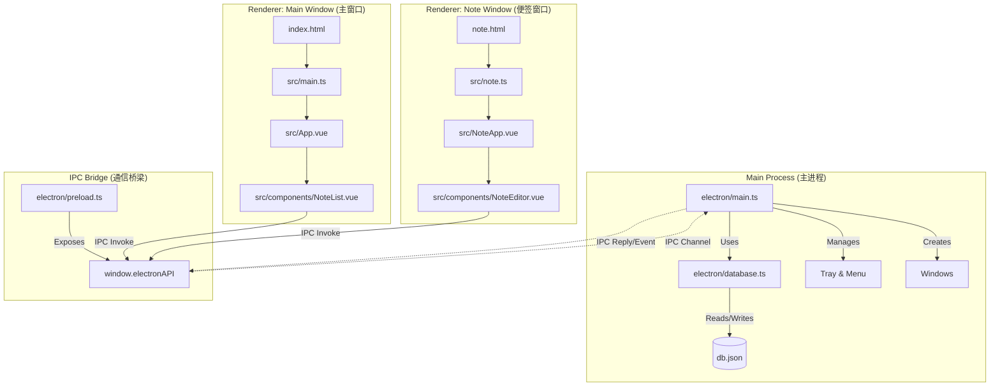

# Electron Sticky Notes - 代码架构分析

本文档详细描述了 Sticky Notes 便签应用的代码结构、模块关系及核心逻辑。

## 1. 核心架构概览

本项目采用 **Electron + Vue 3 + TypeScript** 技术栈，基于 **多窗口模型** 设计。



---

## 2. 模块详细说明

### 2.1 主进程 (Main Process)
**位置**: `electron/`
- **[main.ts](electron/main.ts)**: 应用入口。
  - **窗口管理**: 
    - `createMainWindow()`: 创建主列表窗口，默认居中，尺寸为屏幕 1/2。
    - `createNoteWindow(id)`: 创建独立的便签窗口，无边框设计。
  - **IPC 处理**: 响应渲染层的增删改查请求 (`create-note`, `update-note` 等)。
  - **原生功能**: 管理托盘图标、全局快捷键、右键上下文菜单（颜色/样式选择）。
- **[database.ts](electron/database.ts)**: 数据层。
  - 使用 `lowdb` 管理本地 JSON 数据库。
  - 存储便签内容、位置、颜色、样式及全局设置。

### 2.2 预加载脚本 (Preload Script)
**位置**: `electron/preload.ts`
- **[preload.ts](electron/preload.ts)**: 安全桥梁。
  - 使用 `contextBridge` 将部分 Node.js 能力暴露给渲染进程。
  - 定义 `window.electronAPI` 接口，隔离直接的 IPC 访问。

### 2.3 渲染进程 (Renderer Process)
**位置**: `src/`
本项目配置为 **多页面应用 (MPA)**，通过 Vite 构建。

#### A. 主窗口 (便签列表)
- **入口**: `index.html` -> `src/main.ts`
- **核心组件**: **[NoteList.vue](src/components/NoteList.vue)**
  - 展示所有便签的 4x4 网格视图。
  - 提供全局设置（字体、透明度）和新建便签入口。

#### B. 便签窗口 (独立编辑页)
- **入口**: `note.html` -> `src/note.ts`
- **核心组件**: **[NoteEditor.vue](src/components/NoteEditor.vue)**
  - **UI 设计**: 极简风格，无系统标题栏，自定义右上角控制按钮（置顶、最小化、关闭）。
  - **功能**:
    - **双模式**: 支持 `normal` (文本) 和 `todo` (待办事项) 两种样式。
    - **右键菜单**: 通过 IPC 触发主进程的原生右键菜单，选择 8 种颜色和 2 种样式。
    - **自动保存**: 输入防抖，实时同步数据到本地数据库。

---

## 3. 关键流程解析

### 3.1 颜色/样式切换流程
1. **用户操作**: 在便签窗口 (`NoteEditor.vue`) 右键点击。
2. **IPC 调用**: 渲染进程触发 `show-color-menu` 事件。
3. **主进程响应**: `main.ts` 构建原生 `Menu` 并弹出。
4. **状态更新**: 用户点击菜单项 -> 主进程更新 DB -> 主进程发送 `note-color-changed` 事件。
5. **UI 刷新**: `NoteEditor.vue` 监听到事件，更新本地状态和样式。

### 3.2 窗口删除动画
1. **用户操作**: 点击删除按钮。
2. **主进程处理**: `delete-note` 处理器调用 `shrinkToTaskbar` 函数。
3. **动画逻辑**: 计算当前窗口位置与任务栏右下角的差值，分 12 步逐步缩小并移动窗口 (`setBounds`)，模拟“吸入”效果。
4. **清理**: 动画结束后销毁窗口并从 DB 中移除数据。

---

## 4. 构建与发布
- **配置文件**: `package.json` (electron-builder 配置)
- **构建命令**: `npm run build`
  1. `vite build`: 生成前端静态资源到 `dist/`。
  2. `tsc`: 编译主进程 TypeScript 到 `dist-electron/`。
  3. `electron-builder`: 打包生成 `.exe` 安装文件。

## 5. 项目结构树

```text
electron-sticky-notes/
├── electron/               # 主进程源码
│   ├── main.ts             # 入口文件
│   ├── preload.ts          # 预加载脚本
│   └── database.ts         # 数据库封装
├── src/                    # 渲染进程源码 (Vue 3)
│   ├── components/         # Vue 组件
│   │   ├── NoteEditor.vue  # 便签编辑器
│   │   └── NoteList.vue    # 便签列表
│   ├── main.ts             # 主窗口入口
│   ├── note.ts             # 便签窗口入口
│   ├── App.vue             # 主窗口根组件
│   └── NoteApp.vue         # 便签窗口根组件
├── build/                  # 构建资源 (图标等)
├── release/                # 打包输出目录
├── index.html              # 主窗口模板
├── note.html               # 便签窗口模板
└── vite.config.ts          # Vite 配置
```
